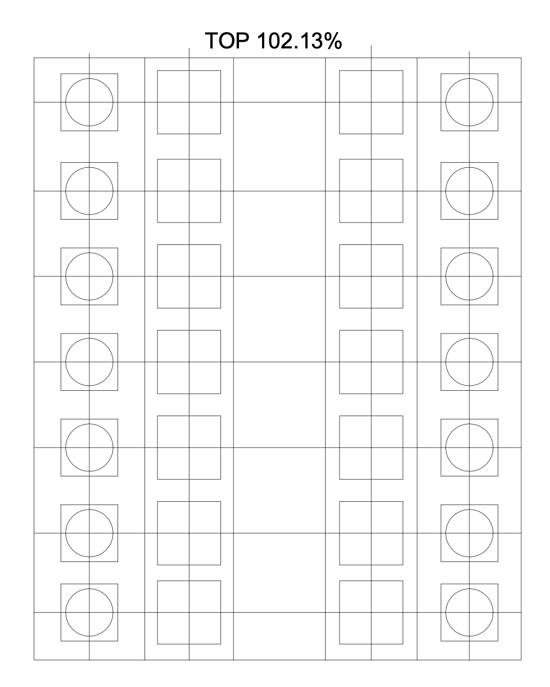

# Electronic Dart Scoreboard for Cricket

## Introduction

Do you like throwing darts? Do you find the pesky chalk or dry erase scoreboards too cumbersome? Well, here's the solution.

So many lights! So many buttons!

I don't remember what possessed me to take up this project. I think I saw those 8x8 LED matrix displays on AdaFruit and wondered to myself, "Hmmm...I wonder what I could make with those?!" Anyway, this project had a ton of wiring, and because it was so tedious, I think I started and stopped it multiple times over the course of a year. It clearly needed to be a properly designed circuit board rather than a big jumble of wiring harnesses. Had I not started with the dry erase scoreboard as the base template, perhaps my brain would have led me in an easier direction. Nevertheless, it turned out really cool.

So how's it work? Just press the lighted button next to each number and the display will go through single (one slash), double (two slashes), and triple (circle) scoring. When you clear a particular number, that number's button LED will turn off. When one player clears all of the numbers, the reset button does a little animation. And there's a fun startup sequence when you power up or reset the game. I mean, if I'm going to use so many fancy chips, I might as well do something fun, right? Here's a video.

https://github.com/dgaff/dart_scoreboard/assets/1971008/4cacc433-6791-4b03-ad2a-5dbcd5b7c47d

## Parts List

This project was built with a lot of overkill components, and the total price tag was over $400 in parts. At mass production pricing, this might get under $100 in BOM cost, but it would still be pricey.

* [Dart dry erase scoreboard](https://www.amazon.com/gp/product/B004959HHO) - $15
* 14 [LED 8x8 matrix displays](https://www.adafruit.com/product/1079) - $105
* 15 [LED-lit momentary SPST pushbutton switches](https://www.adafruit.com/product/1479) - $30
* 2 [Adafruit Itsy-Bitsy M4](https://www.adafruit.com/product/3800) boards - $30
* 14 [Adafruit MAX 7219 matrix LED controllers](https://www.adafruit.com/product/453) - $182
* 2 [Adafruit TLC 5911 RGB controller](https://www.adafruit.com/product/1455) - $15
* 2 [protoboards](https://www.amazon.com/gp/product/B091PZQ4W7) 7cm x 9cm - $2
* 7 [mini protoboards](https://www.amazon.com/gp/product/B081MSKJJX) (cut in half to make 14) - $10
* 1 SPST toggle switch
* 1 DPDT toggle switch
* 1 [micro USB panel mount jack](https://www.amazon.com/gp/product/B082HZKVP1) - $13
* 1/4" 2' x 4' MDF sheet - $15
* Misc fasteners
* Lots of connector wire, some resistors, and 2 usb-micro pigtails

## Build Steps

The scoreboard is divided into two halves, with each half controlled by its own separate circuit. Each circuit contains an [Itsy-Bitsy M4](https://www.adafruit.com/product/3800) microprocessor, 7 [8x8 LED boards](https://www.adafruit.com/product/1079), 7 [MAX7219](https://www.adafruit.com/product/453) LED controllers, 7 [lighted push buttons](https://www.adafruit.com/product/1479), and a [TLC59711](https://www.adafruit.com/product/1455) LED controller.

Each scoring number on the scoreboard has its own 8x8 LED display controlled by a MAX7219 and a lighted pushbutton. The 7 LEDs in the push buttons are lit using the TLC59711 controller rather than directly from the microprocessor. This reduces current consumption and allows for dimming effects on the push buttons. I could have added a couple of chips to keep this to a single processor design, but I didn't. As it is, I use most of the IO pins on the Itsy-Bitsy M4.

There's also a reset button in the center that resets the game. This button triggers a reset on both processor boards. However, only the right processor board controls the reset button's LED, which has an animation effect when someone wins. So, the two separate processor boards have TTL serial between them. This is just used by the left processor board to tell the right processor board if the left side won. This will allow the right board to start the reset button animation. The code is written so that the exact same code runs on each board, though.

### Cutting out the dry erase board

I started with a [dry erase scoreboard](https://www.amazon.com/gp/product/B001E5IC78) from Amazon. I had one of these on the wall next to our dart board already. I found a [square leather punch](https://www.amazon.com/gp/product/B08PB85NFC) to make the square holes in the board for the 8x8 displays. So I made a template in CAD for each display and each push button. Important note: the spacing between each number on this cheap dry erase board is not consistent. This would have made using a single circuit board underneath more challenging. I didn't notice this until I was doing the template in CAD. Second note: at least for me, when I print from CAD (I use Rhino) to a PDF, the scaling is very slightly off when I print the PDF on my LaserJet printer. I'm not sure if this in my printer or if the PDF is off. Regardless, *measure the printout with digital calipers, and adjust the scale factor on the PDF when you print it out.* As the saying goes "measure twice, cut once."

Use the punch carefully! It took some work to cleanly cut each square. The holes for the push buttons were drilled out with a spade bit. I epoxied each display to keep them in place.

### Prototyping

The MAX7219 controller can be driven by SPI, and each MAX needs a CS line. I had to install the display boards in a certain orientation to get the PCB boards to fit, but the CircuitPython libraries support rotation of the images.

I used the same SPI bus for both the 59711 button LED controller and the MAX7219 8x8 display controllers. The 59711 doesn't have a CS
like each of the MAX7219's do. But looking at the datasheets and running some tests on the logic analyzer, I decided it wasn't possible to send a bit
stream to the MAX7219 controller that would mimic the 59711 bit stream (0x25 write command + 218 bits of data). So I just wired the MOSI and CLK lines to all of the MAX7219 and 59711 controllers.

### Circuit Boards

Once again, I regret not taking the time to design a circuit board. There are enough components and wiring required that a single, large PCB would have made the job much easier. Certainly a mass-produced board would have one giant PCB for all controllers, displays, and buttons. Also, these DIP packages are large. I assume the SMC versions are quite a bit smaller and would be better suited for a PCB. Note that the MAX7219 requires a current limiting resistor (Rset). I used 20 kΩ. You can see them on the board as well.

On the top side of the board, I wired: power, ground, chip select, SCK (SPI clock), and MOSI (data).

I soldered the M4 in place at a later stage in the process, because it was easier to wire up all of the IO lines without the M4 daughter board in place. I also soldered up the 5911 controller later in the process for the same reason. The push button LED lines are much easier to solder in when the daughter board is out of the way. But this is what is looks like with the daughter boards in place. NOTE: I used solid copper wire for the top board in order to keep everything in place and mostly out of the way for the time when I would wire up the displays.

I used the bottom of the board to wire up Rset for each MAX chip. I used stranded copper connecting wiring for this. Looking back, perhaps I could have used a single Rset for all of the MAX chips. I should have tested that out.

Wiring up each 8x8 display was a real pain in the ass. First, I cut some small circuit boards in half to get them to fit next to each other on the back side of the dry erase scoreboard (given how close the 8x8 matrices were together). I had hoped I could use a single board to straddle multiple displays, but given the inconsistent font space on the dry erase scoreboard, I had to do one board for each display. (Did I mention that I started and stopped this project multiple times over the course of a year?) Then I made wiring harnesses for each display.

Lastly, I made a bed-of-nails test board to check each wiring harness after it was soldered into it's corresponding MAC controller. Why? Because errors, that's why. I made a lot of wiring mistakes doing this very monotonous wiring task. This tester helped me catch those errors.

Also, there's another important reason. **The 8x8 LED datasheet warns not to use too much heat when soldering the displays and to not resolder them.** They say that you will damage the display if you use too much heat or solder for too long. So, I was worried that there was no room for error on the daughter boards, and given that these displays are epoxied in, I didn't want to have to rip one out.

That said, this bed-of-nails setup didn't work that great. The pogo pins didn't make very good electrical contact with the 8x8 daughter board. It was good enough to generally verify that I had wired up the daughter board correctly, but it wasn't perfect. Perhaps I needed some pogo pins with a sharper point. I'm not sure.

### Pin Mappings and Partial Schematic

Here are the M4 pin mappings

* SCK, MOSI = SPI bus
* D0, D1, D2, D3, D4, D5, D7 = chip select for MAX controllers (for 8x8 matrices)
* D9, D10, D11, D12, D13, A2, A3 = button inputs
* R0, G0, B0, R1, G1, B1, R2 = game button LED outputs
* G2 = reset button LED output
* A5 = game reset input
* A0, A1 = TX and RX for processor board interconnect

MAX7219 Rset = 20 k&Omega;. I did not change the built-in current limiting resistor on the 59711.

Here a partial schematic that shows the wiring for one of the 8x8 matrices and its corresponding push button. I've also labeled the other processor pins.

(TODO partial schematic)

### Even more soldering...

As you can see from the picture, there was a ton of wiring and soldering to connect the display daughter board to the MAX controller chips.

And then there was soldering the 8x8 matrix daughter boards to the displays, which was stressful as I mentioned above because of the reduced temperature and limited solder time duration that the datasheet warned about.

Look at this monstrosity when everything is wired up on one side! It looks like the inside of an old school pinball machine.

As noted, to mass produce this, I would build one large circuit board that held the displays, push buttons, and remaining circuitry. I would also use discrete LEDs for the 8x8 matrix instead of the Luckylight modules from Adafruit. They are quite pricey. The MAX controller chips are expensive too, but I suspect the price drops quite a bit in large quantities.

### The housing

I bought some 1/4 inch thick MDF to build the housing for the scoreboard. Here's the frame of the box getting glued together. 1/4 MDF is a little small for nails.

And here's the frame getting glued to the score board.

Here's what it looked like before I added some structural components.

You can see on the bottom that there are two switches and a USB jack. 

The left switch in the picture is the power switch. Power from the single USB jack is shared between the two processor board. The right switch toggles the USB TX/RX lines between the left and right boards. This is used for programming. So when the USB is connected in the laptop, the Circuit Python drive for the selected board will shop up in Finder. This is incredibly convenient for testing out new code. You can see the wiring here.

The only downside if that if I ever have to update the core Itsy-Bitsy firmware, I'll have to open the box up, since you must double-click the reset button in order to see the boot loader partition on your laptop. Perhaps there's a way to do this programmatically. I'll have to look into it.

### Attaching to the wall

In order to increase the structural integrity of the box, I decided to glue in some additional support blocks that will hold the keyhole mounts. 1/4" MDF is pretty thin, and I didn't want to rely on it alone to hold the scoreboard to the wall. I also put a center piece of wood to provide some structural support for the front of the scoreboard, since users will be pressing buttons on the front of the board, and the dry erase front scoreboard is only about 1/8" thick.

Here's the guts after the glue dried and the screw holes are in place. The sides and back are painted, and the keyhole connectors attached. I painted the box with Rustoleum flat white enamel.

## Misc

* My wife wants the scoreboard to play a little tune when someone wins. :) Guess I'll need to add that to a future version.
* Data sheets and circuit python info are all on the parts links above.
* While searching for ways to do the numbers, I came across the [C-64 character set](https://fabienroyer.wordpress.com/2010/12/03/driving-an-8x8-led-matrix-with-a-netduino-using-persistence-of-vision/). The code is gone, but you can still download the characters. I thought it might be cool to have the Commodore 64 character set on the board, although I didn't end up using it. Perhaps for another project. Here's the character set in case you want to 

